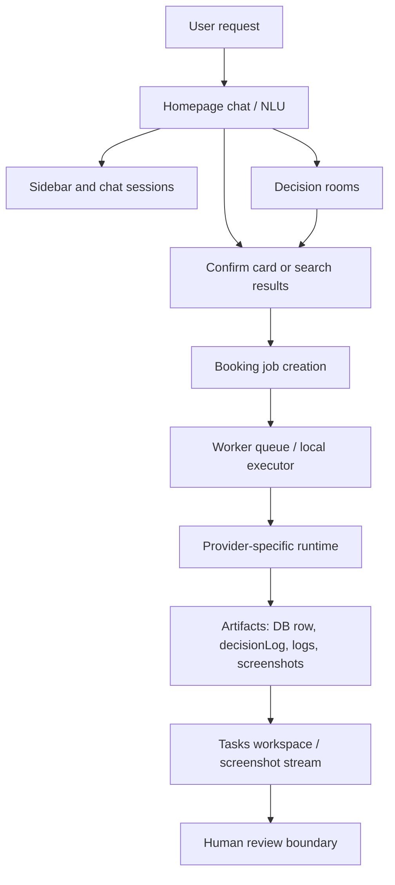

# Onegent System Design

Last updated: 2026-05-07

This document is the high-level architecture map for Onegent. It is meant for
new Codex, Claude, and future engineering agents who need to understand the
system before changing it.

## Product Shape

Onegent is a user-facing decision and execution agent. The product is not just a
recommendation page and not just a browser automation script. The intended loop
is:

1. The user asks in natural language.
2. The app extracts structured intent and missing constraints.
3. The app shows useful options, a confirmation card, or a task card.
4. The runtime executes provider-specific steps until a human-review boundary.
5. The task surface preserves logs, screenshots, current URL, and final status.
6. The user reviews the provider page and performs any final provider action.

The core product promise is execution with evidence. Users should be able to see
what the agent did, what remains, and why it stopped.

## Major Runtime Layers



### Frontend

- `app/page.tsx` is the main chat and recommendation surface.
- `components/Sidebar.tsx` shows rooms, drafts, and completed chat sessions.
- `app/tasks` and task components show active/history task cards, timeline,
  logs, screenshot stream, and final review actions.
- Vertical cards such as restaurant, hotel, flight, and activity cards create
  or attach booking jobs.

Current tradeoff: `app/page.tsx` is too large. It contains chat replay,
NLU orchestration, result rendering, booking profile gates, room replay, and
some task surface logic in one client component. This makes dev compile and
first route load slower than it needs to be.

### API Layer

The API should be split by payload shape:

- `summary` endpoints: small counters and row summaries for fast navigation.
- `list` endpoints: card/list rows without large JSON blobs or screenshots.
- `detail` endpoints: one job/session/room with full logs, steps, and artifacts.
- `bootstrap` endpoints: one compact payload needed by the app shell.

The performance pass on 2026-05-06 adds:

- `/api/app/bootstrap` for compact shell data.
- Compact sidebar room/session rows.
- Client-side short TTL and inflight deduplication for the app shell.

This reduces the old homepage waterfall where the Sidebar fetched rooms and
sessions separately while the homepage also fetched recent booking jobs.

The Tasks workspace now follows the same shape split:

- `/api/booking-jobs/summary` returns only counters for queue/live/history
  chrome.
- `/api/booking-jobs/compact-list` returns compact task rows only: ids,
  labels, status flags, step/action counts, provider/scenario hints, and share
  metadata. It deliberately omits `steps`, `decisionLog`, profiles, logs, and
  screenshot data.
- `/api/booking-jobs/[id]` remains the detail endpoint for exactly one opened
  task. `/tasks` calls it only when the user expands, focuses, or modifies a
  task.
- `/api/booking-jobs/[id]/timeline-events` and
  `/api/booking-jobs/[id]/snapshots` are loaded only by the visible live/details
  panel. Snapshot responses are metadata plus image URLs; image bytes load from
  the image route only when the snapshot card is visible or selected.

This keeps route navigation from waiting on large `booking_jobs.steps` JSON,
decision logs, agent logs, or screenshot streams for tasks the user has not
opened.

Task workspace links should go through `lib/booking-jobs/workspace.ts` instead
of hand-built `/tasks` URLs. The shared rule is:

- `queue`: jobs that are created but not yet running (`pending`,
  `pending_local`).
- `live`: jobs that are actively executing (`running`).
- `history`: completed, failed, or human-review boundary jobs, including
  `awaiting_confirmation` / ready-for-review states.

The same helper powers compact read models, calendar/room/itinerary links, and
chat task cards so a completed task remains discoverable from its source
session while logs and screenshots stay lazy-loaded for the focused task only.

The app shell and adjacent workspaces now use the same compact-first rule:

- `/api/app/bootstrap` is the shared shell payload for Sidebar and GlobalNav.
  It carries compact room/session rows, account display metadata, recent job
  counters, and excludes room context, chat messages, provider logs, and task
  detail artifacts.
- `/api/rooms/compact-list` powers the Rooms list from id/title/type/status,
  short code, membership status, and routing metadata. Full room context,
  synthesis JSON, proposals, votes, and messages stay behind room detail APIs.
- `/api/contacts/bootstrap` powers the first Contacts paint from profile,
  contact rows, and counts. Groups, blocked users, suggestions, and DM threads
  load only when their section or contact pane is opened.
- `/api/calendar/jobs` returns calendar-specific task rows with minimized
  steps for event placement. It excludes autonomy settings, policies,
  decision logs, runtime errors, screenshots, and logs.
- `/api/calendar/google/status` is the compact Google connection check.
  `/api/calendar/google/month` reads cached local Google event rows, and
  `force=1` is reserved for the explicit "Sync now" action.

### Data Layer

Postgres/Neon is the source of truth for durable product state:

- `chat_sessions` and messages store solo chat history and replay state.
- `decision_rooms` and related rows store multi-user decision flows.
- `booking_jobs` stores provider execution state, steps, decision logs, and
  handoff metadata.
- Screenshot/log artifacts are referenced by job/task ids and surfaced through
  the task timeline.

Important design rule: list surfaces should not select large JSON payloads by
default. Heavy fields such as `steps`, `context_json`, `synthesis_json`, and
screenshots belong behind detail calls or artifact APIs.

### Worker And Provider Execution

Provider work runs outside the main UI interaction path when possible:

- The app creates a booking job.
- A worker or local executor claims the job.
- Provider-specific code navigates and interacts with the provider page.
- The runtime records decisions, logs, screenshots, and final state.
- The user sees the task state update in the Tasks workspace.

The worker layer must stay single-owner per queue in local development. Multiple
stale workers against one DB queue can produce confusing evidence, stale code
paths, and duplicated attempts.

### Evidence Layer

Every execution lane should leave enough evidence for debugging without asking
the founder to manually copy browser text:

- DB row: status, steps, terminal reason, handoff URL.
- `decisionLog`: structured runtime decisions.
- App and worker logs: timestamped and tied to a worker instance.
- Screenshot stream: step-level visual evidence.
- Current provider URL and stage signals.

The task UI should show both a compact status card and a detail surface with
timeline plus screenshots. Screenshots are product evidence, not decoration.

## Parallel Development Model

Onegent uses multiple agents to increase development throughput, not to grow
the codebase without discipline. The architecture should make parallel work
safe by giving each agent a narrow ownership boundary and a stable contract to
plug into.

Parallel work is valuable when it:

- closes a named product or reliability gap;
- expands benchmark coverage in a reusable schema;
- reduces latency, payload size, bundle size, polling, or local process churn;
- improves task evidence, status, ownership, or replay behavior;
- extracts shared pure helpers that reduce mirror drift.

Parallel work is harmful when it:

- creates vertical-specific schemas instead of shared contracts;
- adds broad abstractions before a repeated problem exists;
- duplicates provider runtime logic across `lib/` and `worker/`;
- adds route-level client code that slows the app shell;
- lands docs-only packaging while the real blocker remains untouched.

The sustainable flow is a rolling merge train:

```text
accepted base
-> side agents branch into isolated worktrees
-> each agent returns branch + commit + evidence + validation
-> Codex fast-triages each branch
-> independent next tasks can start before earlier branches are fully merged
-> Codex integrates in dependency order and keeps contracts coherent
```

Do not make every agent wait for Codex to finish a full merge if the next task
does not depend on the unmerged branch. Do make agents wait when the next task
depends on a new shared schema, runtime contract, or read model that has not
landed yet.

`scripts/layered-agent-intake.ts` is the no-live intake queue for returned
agent branches. It reads static JSON or Markdown metadata and classifies each
branch as `ready_to_merge`, `needs_followup`, or `reject`. The schema records
task kind, base, changed files, validations, dependency edges, supersession, and
rebase requirements without touching provider runtime or live artifacts.

Every returned side-agent task must be one of:

- `runtime_fix`
- `benchmark_fixture`
- `read_model_perf`
- `task_workspace_ux`
- `docs_contract`

Codex can start independent work before previous branches are merged. It should
pause only when the next task depends on an unmerged shared contract, such as a
shared schema branch or read-model contract that later agents must import.

## Performance Model

The app should feel fast because the shell loads compact data first and heavy
details load only when a user opens them.

Current performance principles:

1. Avoid request waterfalls. Start independent reads in parallel or collapse
   them into a small bootstrap read model.
2. Keep shell payloads compact. Sidebar rows should not include full room
   context or synthesis JSON.
3. Use one client cache for shared shell data. If Sidebar and homepage need the
   same data, they should reuse the same inflight request.
4. Load task detail lazily. List rows should not pull every step, log, or
   screenshot.
5. Keep provider execution out of render paths. Browser/worker work should not
   block route navigation.
6. Keep common client bundles lean. Task timelines, notification inbox lists,
   contact DM panes, and screenshot streams are lazy surfaces, not app-shell
   imports.
7. Keep homepage result families lazy. Restaurant, hotel, flight, activity,
   trip-package, confirmation, profile-gap, and inline task observer surfaces
   should not inflate the first chat/composer bundle before any result exists.

Tasks-specific runtime rules:

1. Initial `/tasks` render starts only the compact list and summary reads.
2. Expanding one row fetches that single task detail and caches/dedupes it by
   job id.
3. Active expanded rows may poll their detail; completed/history rows do not
   poll detail unless the user reopens or mutates them.
4. The live timeline panel owns timeline and snapshot polling, and polling
   stops when the timeline reports a closed run.
5. Chat cards and `/tasks` share the same focus href logic:
   `/tasks?view=<queue|live|history>&focus=<jobId>`. Active tasks open as
   Watch; terminal tasks open as Evidence so completed screenshots and logs
   remain discoverable.
6. Future performance checks can use
   `npx tsx scripts/measure-app-performance.ts --base-url http://127.0.0.1:3000 --session-id <sid> [--job-id <id>]`
  to record endpoint latency and response bytes.

Calendar-specific runtime rules:

1. `/calendar` renders its month shell immediately from an empty/local grid.
2. Local task calendar events load from `/api/calendar/jobs`, not the full
   booking-job list endpoint.
3. Google connection status loads separately from month data.
4. Google network sync is explicit via "Sync now"; page entry does not force
   a Google API refresh.
5. Existing cached Google busy/event rows may overlay the grid after the shell
   is visible.

NLU and internal-benchmark rules:

1. `lib/agent/nlu-v2/routing-matrix.ts` is a no-live router/normalizer
   regression matrix. It starts from prebuilt `IntentState` objects and proves
   deterministic routing, constraint preservation, and confirm-card selection.
   It does not prove live model extraction.
2. `lib/agent/nlu-v2/live-extractor-eval.ts` is the raw-utterance no-live
   extractor harness. It runs raw text through a deterministic parser,
   `coerceIntentState`, activity normalizer, and router so dogfood phrases can
   be regression-tested without OpenAI calls. It still does not prove live LLM
   extraction accuracy.
3. `scripts/eval-nlu-routing.ts` is the local smoke command for routing
   fixtures. Add every founder dogfood routing failure there before changing
   planner behavior.
4. `scripts/eval-live-extractor.ts --vertical all --count 120 --gate` is the
   local smoke command for raw utterance constraints, including activity vs
   trip, hotel date/budget, restaurant cuisine, flight route/date, refine,
   profile edit, ambiguous, and chitchat cases.
5. `scripts/internal-benchmark.ts --mode no-live` is the only implemented
   internal benchmark mode. Its corpus has 200+ structured cases split across
   restaurant, hotel, flight, activity, and trip/composite/ambiguous/profile/
   refine buckets, with artifact expectations, failure classes, dogfood
   mappings, and suggested owners.
6. `scripts/layered-benchmark.ts --mode no-live` is the L1/L2 closure
   orchestration benchmark. It starts after synthetic provider evidence exists
   and models L1 runtime result, failure classification, L2 Browser Harness
   eligibility, simulated recovery, optional patch proposal, and final verdict.
   It does not run Browser Harness, providers, workers, OpenAI, checkout, login,
   payment, or final confirmation flows.
7. Layered Benchmark V2 escalates to L2 only for page/control classes:
   `selector_drift`, `click_miss`, `iframe_miss`, `field_fill_miss`,
   `progress_stall`, and `unknown_page_mutation`, and only with complete
   evidence. It must not escalate true no-availability, provider degradation,
   account checkpoints, user-only final actions, insufficient evidence, or
   network/model/env failures.
8. Internal benchmark failures should name one owner: `nlu`, `planner`,
   `task-workspace`, `provider-runtime`, or `product/manual-boundary`.
9. Benchmark success is not provider closure. A vertical is provider-proven
   only when runtime evidence, DB fields, logs, screenshots, and safe terminal
   status are captured by the provider-closure process.

## Strengths

- The product has a clear execution loop from chat to task to review.
- Provider work leaves auditable artifacts instead of opaque "agent succeeded"
  messages.
- The system already supports multiple verticals: restaurant, hotel, flight,
  and activity.
- The human-review boundary is a product primitive, not an afterthought.
- Read-only dev/operator surfaces and runbooks make provider debugging more
  repeatable.

## Weaknesses And Tradeoffs

- `app/page.tsx` is still a large client component, but heavy result surfaces
  are now split behind dynamic imports. Further work should extract state hooks
  and presentational chat sections rather than adding more logic to the page.
- Some detail routes still return heavy rows by default. The list surfaces for
  Tasks, Rooms, Contacts, and Calendar now have compact entry paths, but deeper
  detail panels can still be split further.
- Local development can become slow when multiple Next dev servers, workers,
  and browser executors are left running.
- Provider sites are brittle. Runtime code must be evidence-driven and
  provider-specific.
- Runtime provider code is mirrored between `lib/booking-autopilot/**` and
  `worker/src/booking-autopilot/**`. Follow
  `docs/30-provider-debug/RUNTIME_MIRROR_GUIDE.md` before editing either side.
- Docs and coordination state are strong, but the number of branches/worktrees
  can make it easy to test the wrong code unless process ownership is checked.

## Near-Term Architecture Priorities

1. Continue migrating calendar/detail surfaces from compact step rows toward
   precomputed event read models if calendar usage grows.
2. Split `app/page.tsx` into smaller route-level and feature-level components.
3. Lazy-load heavy cards and modals only when the user reaches that state.
4. Expand `scripts/eval-nlu-routing.ts` and `scripts/internal-benchmark.ts`
   with every founder dogfood routing failure before changing planner behavior.
5. Add app-shell performance marks around route transitions, bootstrap, sidebar
   hydration, and task detail open.
6. Keep one active local dev server and one worker for the current lane.
7. Continue storing screenshot/log artifacts under job ids so task details are
   portable across routes and ports.

## Change Checklist For Future Agents

Before changing a performance-critical path:

1. Identify whether the surface needs summary, list, or detail data.
2. Check whether the route returns heavy JSON fields by accident.
3. Avoid adding new client-side waterfalls.
4. Prefer one read-model helper shared by route and tests.
5. Add a small test for shape/count behavior when the read model is non-trivial.
6. Run `npx tsc --noEmit --pretty false`, `npm run check-drift`, and the phase
   gate before landing.
