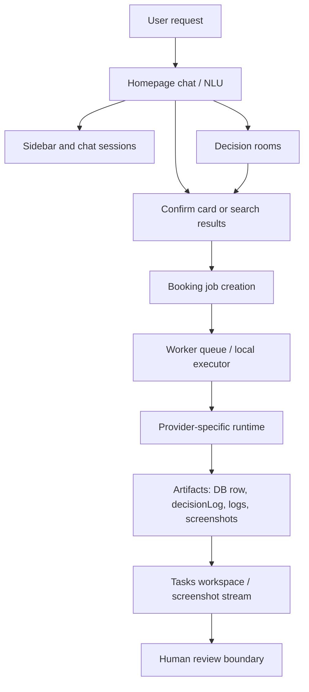

# Onegent System Design

Last updated: 2026-05-06

This document is the high-level architecture map for Onegent. It is meant for
new Codex, Claude, and future engineering agents who need to understand the
system before changing it.

## Product Shape

Onegent is a user-facing decision and execution agent. The product is not just a
recommendation page and not just a browser automation script. The intended loop
is:

1. The user asks in natural language.
2. The app extracts structured intent and missing constraints.
3. The app shows useful options, a confirmation card, or a task card.
4. The runtime executes provider-specific steps until a human-review boundary.
5. The task surface preserves logs, screenshots, current URL, and final status.
6. The user reviews the provider page and performs any final provider action.

The core product promise is execution with evidence. Users should be able to see
what the agent did, what remains, and why it stopped.

## Major Runtime Layers

### Frontend

- `app/page.tsx` is the main chat and recommendation surface.
- `components/Sidebar.tsx` shows rooms, drafts, and completed chat sessions.
- `app/tasks` and task components show active/history task cards, timeline,
  logs, screenshot stream, and final review actions.
- Vertical cards such as restaurant, hotel, flight, and activity cards create
  or attach booking jobs.

Current tradeoff: `app/page.tsx` is too large. It contains chat replay,
NLU orchestration, result rendering, booking profile gates, room replay, and
some task surface logic in one client component. This makes dev compile and
first route load slower than it needs to be.

### API Layer

The API should be split by payload shape:

- `summary` endpoints: small counters and row summaries for fast navigation.
- `list` endpoints: card/list rows without large JSON blobs or screenshots.
- `detail` endpoints: one job/session/room with full logs, steps, and artifacts.
- `bootstrap` endpoints: one compact payload needed by the app shell.

The performance pass on 2026-05-06 adds:

- `/api/app/bootstrap` for compact shell data.
- Compact sidebar room/session rows.
- Client-side short TTL and inflight deduplication for the app shell.

This reduces the old homepage waterfall where the Sidebar fetched rooms and
sessions separately while the homepage also fetched recent booking jobs.

### Data Layer

Postgres/Neon is the source of truth for durable product state:

- `chat_sessions` and messages store solo chat history and replay state.
- `decision_rooms` and related rows store multi-user decision flows.
- `booking_jobs` stores provider execution state, steps, decision logs, and
  handoff metadata.
- Screenshot/log artifacts are referenced by job/task ids and surfaced through
  the task timeline.

Important design rule: list surfaces should not select large JSON payloads by
default. Heavy fields such as `steps`, `context_json`, `synthesis_json`, and
screenshots belong behind detail calls or artifact APIs.

### Worker And Provider Execution

Provider work runs outside the main UI interaction path when possible:

- The app creates a booking job.
- A worker or local executor claims the job.
- Provider-specific code navigates and interacts with the provider page.
- The runtime records decisions, logs, screenshots, and final state.
- The user sees the task state update in the Tasks workspace.

The worker layer must stay single-owner per queue in local development. Multiple
stale workers against one DB queue can produce confusing evidence, stale code
paths, and duplicated attempts.

### Evidence Layer

Every execution lane should leave enough evidence for debugging without asking
the founder to manually copy browser text:

- DB row: status, steps, terminal reason, handoff URL.
- `decisionLog`: structured runtime decisions.
- App and worker logs: timestamped and tied to a worker instance.
- Screenshot stream: step-level visual evidence.
- Current provider URL and stage signals.

The task UI should show both a compact status card and a detail surface with
timeline plus screenshots. Screenshots are product evidence, not decoration.

## Performance Model

The app should feel fast because the shell loads compact data first and heavy
details load only when a user opens them.

Current performance principles:

1. Avoid request waterfalls. Start independent reads in parallel or collapse
   them into a small bootstrap read model.
2. Keep shell payloads compact. Sidebar rows should not include full room
   context or synthesis JSON.
3. Use one client cache for shared shell data. If Sidebar and homepage need the
   same data, they should reuse the same inflight request.
4. Load task detail lazily. List rows should not pull every step, log, or
   screenshot.
5. Keep provider execution out of render paths. Browser/worker work should not
   block route navigation.

## Strengths

- The product has a clear execution loop from chat to task to review.
- Provider work leaves auditable artifacts instead of opaque "agent succeeded"
  messages.
- The system already supports multiple verticals: restaurant, hotel, flight,
  and activity.
- The human-review boundary is a product primitive, not an afterthought.
- Read-only dev/operator surfaces and runbooks make provider debugging more
  repeatable.

## Weaknesses And Tradeoffs

- `app/page.tsx` is still a large client component. It increases compile cost,
  bundle size, and route transition latency.
- Some routes still return heavy rows by default. More `summary/list/detail`
  split work is needed.
- Local development can become slow when multiple Next dev servers, workers,
  and browser executors are left running.
- Provider sites are brittle. Runtime code must be evidence-driven and
  provider-specific.
- Docs and coordination state are strong, but the number of branches/worktrees
  can make it easy to test the wrong code unless process ownership is checked.

## Near-Term Architecture Priorities

1. Finish compact read models for task list and task detail so `/tasks` never
   pulls full job payloads for rows.
2. Split `app/page.tsx` into smaller route-level and feature-level components.
3. Lazy-load heavy cards and modals only when the user reaches that state.
4. Add app-shell performance marks around route transitions, bootstrap, sidebar
   hydration, and task detail open.
5. Keep one active local dev server and one worker for the current lane.
6. Continue storing screenshot/log artifacts under job ids so task details are
   portable across routes and ports.

## Change Checklist For Future Agents

Before changing a performance-critical path:

1. Identify whether the surface needs summary, list, or detail data.
2. Check whether the route returns heavy JSON fields by accident.
3. Avoid adding new client-side waterfalls.
4. Prefer one read-model helper shared by route and tests.
5. Add a small test for shape/count behavior when the read model is non-trivial.
6. Run `npx tsc --noEmit --pretty false`, `npm run check-drift`, and the phase
   gate before landing.
